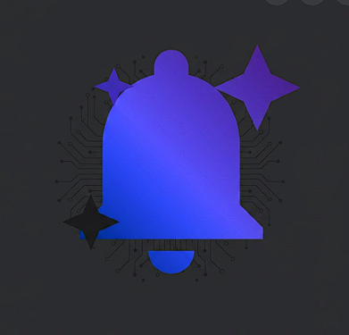

<div align="center">



# SIGNAL
### AI-Powered Notification Intelligence & Decision Enforcement

[](https://developer.android.com)
[](https://kotlinlang.org)
[](https://developer.android.com/jetpack/compose)
[](https://groq.com)
[](https://developer.android.com/tools/releases/platforms)
[](LICENSE)

*Built in 24 hours at MS Ramaiah Institute of Technology by Team BBBY*

</div>

---

## 📌 Evaluation Resources

All requested resources for the evaluation process are available below:

- 🎬 **Project Video Demo:** [Watch Demo](#) *(Insert Link Here)*
- 📊 **PPT Presentation:** [View Slides](#) *(Insert Link or see `/docs` folder)*
- 📦 **Demo APK:** [Download Demo APK (app-release.apk)](apk/app-release.apk?raw=true)
- 🤖 **AI Disclosure:** [Read Full AI Disclosure (AIDISCLOSURE.md)](AIDISCLOSURE.md)
- 💻 **Complete Source Code:** Included in this repository.

---

## 🛑 The Problem & Market Gap

Your phone receives hundreds of notifications a day. An IEEE paper deadline sits next to a pizza discount. A client meeting reminder is buried under 23 group messages. You swipe them all away - and forget the deadline.

### What Exists in the Market & Why It Fails
- **Notification Managers (e.g., Focus Mode, Android Notification History):** They simply group, delay, or hide the noise. They don't actively help you take action on critical items.
- **To-Do List Apps (e.g., Todoist, Google Tasks):** They require high user friction. You have to manually open the app, copy the task, and set a reminder.
- **Traditional AI Assistants (e.g., Siri, Google Assistant):** They are reactive. They only act when explicitly asked, rather than proactively catching deadlines as they arrive.

### The Missing Layer: Decision Enforcement
The core gap in the market is **notification fatigue leading to task avoidance**. When important information arrives, users reflexively swipe it away because they are busy, with the false promise of "I'll deal with it later."

---

## 🏆 Why SIGNAL is the Best Solution

SIGNAL is not just another task app-it is an **AI-Powered Notification Intelligence & Decision Enforcement** system. It intercepts notifications and uses on-device edge classification (via Groq) to force a decision before you can forget the task.

### What It Solves
- **Eliminates Manual Task Entry:** The AI automatically extracts the task, priority, and deadline from raw notifications.
- **Prevents Swiping Away Responsibilities:** The **Mandatory Full-Screen Overlay** cannot be dismissed passively. You must choose an action (Do Now, Schedule, Delegate, or Ignore with a typed reason).
- **Ensures Accountability:** Every decision is logged, and deferred tasks are aggressively resurfaced exactly when scheduled.

### 🧪 Real-World Testing & Impact
We validated SIGNAL by testing it among **20-30 students** in a high-stress, fast-paced academic environment. 
- **Reduced Missed Notifications:** Students drastically stopped missing critical academic, club, and placement cell deadlines that used to get buried in WhatsApp groups.
- **Fixed the "Ignoring" Habit:** The mandatory overlay successfully broke the muscle-memory habit of passive swiping.
- **Solved the "Remembering" Problem:** By forcing users to either schedule the task or do it immediately at the moment of interception, cognitive load and anxiety around forgotten tasks were heavily reduced.

---

## What SIGNAL Does

SIGNAL runs silently in the background, intercepts every notification, and sends it through a Groq AI pipeline that classifies its importance, extracts the actual task, and identifies the deadline. For anything critical or high-priority, it surfaces a **mandatory full-screen overlay** - you cannot swipe it away. You must choose: *Do Now, Schedule, Delegate, or Ignore (with a reason)*.

Every decision is logged. Over time, your dashboard shows you exactly where your attention goes and where it disappears.

```
Raw Notification
   ↓
AI Classification (Groq | LLaMA 3.3-70b · ~500 tok/s)
   ↓
Structured Task (importance | category | deadline | actions)
   ↓
Enforcement Overlay (mandatory decision - no swipe-away)
   ↓
Logged Decision (do now / schedule / delegate / ignore + reason)
   ↓
Automated Follow-up (WorkManager reminder at exact scheduled time)
   ↓
Accountability Dashboard (streaks | weekly chart | avoidance patterns)
```

---

## Features

### Notification Interceptor
- Captures every incoming notification system-wide via `NotificationListenerService`
- Filters noise - duplicates, empty bodies, system chrome notifications
- Extracts source app, title, body, and timestamp asynchronously

### Groq AI Classification Engine
- Sends each notification to **Groq API** (`llama-3.3-70b-versatile`)
- Returns structured JSON: importance level, category, extracted task, natural-language deadline, ISO timestamp, suggested action labels, and `requiresEnforcement` flag
- Responds in under 2 seconds - fast enough to feel instant
- Graceful fallback to manual review queue on API failure

### Decision Enforcement Overlay
- Full-screen overlay (`TYPE_APPLICATION_OVERLAY`) that cannot be dismissed passively
- Back button shows a warning - you must pick an action
- Four decisions:
 - **Do Now** - marks in-progress, opens source app directly
 - **Schedule** - date/time picker → WorkManager exact-time reminder → re-surfaces overlay at that moment
 - **Delegate** - opens share sheet to forward the task
 - **Ignore** - requires a typed reason (min 10 chars) - no silent dismissal
- Live countdown timer on time-sensitive tasks
- Spring-physics entrance animation

### Smart Task Board (Inbox)
- Unified inbox with filter chips: Priority, Deadlines, Meetings, Payments, Messages, Reminders, Missed, and Adverts
- Section grouping: Overdue (pulsing red border), High Priority, In Progress, Pending, and Completed
- Tap to expand - full original notification body, captured timestamp, decision history
- FAB to add manual tasks (tasks received outside the app)
- Live search across task text and source app name

### Accountability Dashboard
- Today at-a-glance: Captured, Actioned, Scheduled, and Ignored
- 7-day stacked bar chart (built with Compose Canvas API - no external chart library)
- Streak counter - consecutive days with zero ignored critical tasks
- Most-Avoided list - categories you keep deferring
- AI behavioral insight - dynamic tip based on your current pattern

### Automation Engine
- **Deferred task resurfacing** - WorkManager re-shows enforcement overlay at exactly the scheduled time; snooze twice and the option is removed
- **Overdue escalation** - missed deadlines re-appear with an OVERDUE badge
- **Google Calendar auto-integration** - meeting notifications auto-create calendar events with 15-minute reminders
- **Daily digest** - 8 AM push: pending count + overdue count
- **Quiet Hours** - batch overnight enforcements; show consolidated overlay on wake

### Settings
- Light / Dark mode toggle (stored in DataStore, applies instantly app-wide)
- Enforcement level: Critical Only, High & Critical, or All
- Quiet Hours switch (11 PM to 7 AM)
- Calendar sync toggle
- Danger zone: Clear all data with confirmation

---

## Architecture

```
┌─────────────────────────────────────────────┐
│ UI LAYER (Jetpack Compose + Material 3)  │
│ TaskBoardScreen, DashboardScreen      │
│ SettingsScreen, OnboardingScreen      │
│ EnforcementOverlayActivity         │
└──────────────────┬──────────────────────────┘
          │ StateFlow / collectAsStateWithLifecycle
┌──────────────────▼──────────────────────────┐
│ VIEWMODEL LAYER               │
│ TaskViewModel · DashboardViewModel     │
│ SettingsViewModel              │
└──────────────────┬──────────────────────────┘
          │
┌──────────────────▼──────────────────────────┐
│ REPOSITORY (single source of truth)    │
│ TaskRepository · OnboardingRepository    │
└────────┬─────────────────────────┬──────────┘
     │             │
┌────────▼────────┐  ┌──────────▼──────────┐
│ ROOM DATABASE │  │ GROQ API (Retrofit) │
│ TaskDao    │  │ llama-3.3-70b    │
│ TaskEntity   │  │ Google Calendar API │
└─────────────────┘  └─────────────────────┘
     ▲
┌────────┴─────────────────────────────────────┐
│ BACKGROUND LAYER               │
│ NotificationListenerService         │
│ WorkManager Workers             │
│ AlarmScheduler, ReminderReceiver      │
└───────────────────────────────────────────────┘
```

**Pattern:** MVVM + Clean Architecture 
**DI:** Hilt (Dagger) 
**Async:** Kotlin Coroutines + Flow throughout

---

## Tech Stack

| Layer | Technology |
|-------|-----------|
| Language | Kotlin |
| UI | Jetpack Compose, Material 3 |
| Navigation | Navigation Compose |
| State | ViewModel · StateFlow · `collectAsStateWithLifecycle` |
| DI | Hilt (Dagger) |
| Local DB | Room (SQLite) |
| Preferences | DataStore Preferences |
| Networking | Retrofit 2, OkHttp 3, Gson |
| AI | Groq API - `llama-3.3-70b-versatile` |
| Background | WorkManager, NotificationListenerService |
| Overlay | `TYPE_APPLICATION_OVERLAY` system window |
| Calendar | Google Calendar API |
| Min SDK | API 26 (Android 8.0 Oreo) |
| Target SDK | API 35 |

---

## Project Structure

```
app/src/main/java/com/example/signal/
├── data/
│  ├── local/
│  │  ├── AppDatabase.kt     # Room DB setup
│  │  ├── TaskDao.kt       # All DB queries
│  │  └── TaskEntity.kt      # DB schema
│  ├── model/
│  │  ├── ClassifiedTask.kt
│  │  ├── ImportanceLevel.kt
│  │  ├── TaskCategory.kt
│  │  └── TaskStatus.kt
│  ├── remote/
│  │  ├── GroqApiService.kt    # Retrofit interface
│  │  ├── GroqClassifier.kt    # AI call + JSON parsing
│  │  └── GroqModels.kt      # Request/response models
│  └── repository/
│    ├── OnboardingRepository.kt # DataStore: onboarding + dark mode
│    └── TaskRepository.kt    # All business logic
├── di/
│  ├── DatabaseModule.kt
│  ├── NetworkModule.kt
│  └── WorkerModule.kt
├── service/
│  └── NotificationInterceptorService.kt
├── ui/
│  ├── dashboard/
│  │  ├── DashboardScreen.kt
│  │  └── DashboardViewModel.kt
│  ├── enforcement/
│  │  ├── EnforcementOverlayActivity.kt
│  │  └── EnforcementViewModel.kt
│  ├── navigation/
│  │  └── MainNavigation.kt
│  ├── onboarding/
│  │  └── OnboardingScreen.kt
│  ├── settings/
│  │  ├── SettingsScreen.kt
│  │  └── SettingsViewModel.kt
│  ├── taskboard/
│  │  ├── TaskBoardScreen.kt
│  │  └── TaskViewModel.kt
│  └── theme/
│    ├── Color.kt        # Full design-token palette
│    ├── Theme.kt        # Light + Dark ColorScheme
│    └── Type.kt         # Typography scale
├── utils/
│  └── CalendarHelper.kt
├── worker/
│  ├── AlarmScheduler.kt
│  ├── OverdueScanWorker.kt
│  ├── ReminderReceiver.kt
│  ├── SweepWorker.kt
│  ├── TaskRescheduleWorker.kt
│  └── WorkManagerHelper.kt
├── MainActivity.kt
└── SignalApplication.kt
```

---

## 🛠 How We Built This

We put together this project using an awesome mix of tools to move incredibly fast. 
- We used **Android Studio** and **VS Code** as our primary IDEs. 
- **Zed** was used for some blazing fast file edits on the side. 
- For AI-assisted coding, we heavily relied on **GitHub Copilot** and **Claude models** to brainstorm logic, handle edge cases, and refine our UI components.
- We also integrated **Antigravity** to help orchestrate some of our multi-file codebase changes rapidly.

### App Permissions (On First Launch)
When you open SIGNAL for the first time, our onboarding flow will ask for three permissions:

| Permission | Why |
|-----------|-----|
| **Notification Listener** | To intercept and classify incoming notifications |
| **Display Over Other Apps** | To show the enforcement overlay above any app |
| **Calendar** (optional) | To auto-create meeting events |

---

## AI Disclosure

👉 **[Read the Full AI Disclosure & Development Usage (AIDISCLOSURE.md)](AIDISCLOSURE.md)**

This project uses AI models to analyse and classify incoming notifications. Please review the disclosure below and ensure you follow privacy and submission rules.

- **Model & Provider:** Groq - `llama-3.3-70b-versatile` (accessed via the Groq API).
- **Primary Purpose:** Real-time classification of notifications to determine importance, extract actionable tasks, and identify deadlines and suggested actions for enforcement.
- **Data Sent to API:** Only notification metadata (source app, title, body, and timestamp) is sent to the Groq API for classification. Do not include extra sensitive data in notifications that will be sent to the model. API calls require a valid `GROQ_API_KEY` configured in `local.properties`.
- **Storage & Handling:** The repository does not include model weights. Structured classification outputs (importance, task text, timestamps) are stored locally in Room; raw model responses are not persisted beyond what is necessary for parsing.
- **Developer Tooling:** Developers may have used AI-assisted development tools (e.g., code completion or suggestion tools). Those artifacts are not part of the deliverable - the repo contains only the app source and runtime classification pipeline.
- **Privacy Note:** Users must grant the Notification Listener permission to enable the feature. Before using the app on personal data, review the privacy implications and avoid sending highly sensitive content to third-party APIs.

## AI Classification - How It Works

Every notification goes through this pipeline:

```kotlin
// GroqClassifier.kt (simplified)
suspend fun classify(notification: NotificationData): ClassifiedTask {
  val response = groqApi.classify(
    GroqRequest(
      model  = "llama-3.3-70b-versatile",
      messages = listOf(
        GroqMessage("system", SYSTEM_PROMPT),
        GroqMessage("user",  buildUserPrompt(notification))
      ),
      temperature = 0.1,  // low temp = deterministic JSON
      maxTokens  = 300
    )
  )
  return parseJson(response.choices[0].message.content)
}
```

The model returns structured JSON:

```json
{
 "importance": "critical",
 "category": "deadline",
 "task": "Submit IEEE paper by tonight 11:59 PM",
 "deadline": "tonight 11:59 PM",
 "deadlineTimestamp": "2024-11-15T23:59:00",
 "actions": ["Open WhatsApp", "Set Reminder", "Start Now"],
 "requiresEnforcement": true
}
```

Groq's **llama-3.3-70b** processes at ~500 tokens/second - the classification happens faster than the user can look at their phone.

---

## Data Model

```kotlin
@Entity(tableName = "tasks")
data class TaskEntity(
  @PrimaryKey val id: String,
  val sourceApp: String,      // "WhatsApp", "Gmail", …
  val packageName: String,
  val originalTitle: String,
  val originalBody: String,
  val capturedAt: Long,      // Unix epoch ms
  val extractedTask: String,    // AI-extracted plain-English task
  val importance: String,     // CRITICAL | HIGH | MEDIUM | LOW
  val category: String,      // DEADLINE | MEETING | PAYMENT | …
  val deadline: String?,      // Human-readable deadline
  val deadlineTimestamp: Long?,  // Epoch ms for comparison
  val suggestedActions: String,  // JSON array (stored as string)
  val status: String,       // PENDING | IN_PROGRESS | DONE | IGNORED
  val userDecision: String?,    // DO_NOW | SCHEDULE | DELEGATE | IGNORE
  val ignoreReason: String?,
  val scheduledFor: Long?,
  val decidedAt: Long?,
  val completedAt: Long?,
  val requiresEnforcement: Boolean,
  val isOverdue: Boolean,
  val rescheduleCount: Int = 0
)
```

---

## Design System

The UI follows a custom **Indigo-based design system** with full light and dark theme support. Colours are defined as semantic tokens in `Color.kt` and mapped to Material 3's full colour scheme in `Theme.kt`.

| Token | Dark | Light | Use |
|-------|------|-------|-----|
| `primary` | `#818CF8` | `#4F46E5` | Accent, buttons, links |
| `background` | `#111520` | `#F8F9FC` | Screen backgrounds |
| `surface` | `#181C28` | `#FFFFFF` | Cards, sheets |
| `outlineVariant` | `#1E2230` | `#E8ECF5` | Card borders |
| `Rose500` | `#EF4444` | `#EF4444` | Critical / error |
| `Amber500` | `#F59E0B` | `#F59E0B` | High / warning |
| `Blue500` | `#3B82F6` | `#3B82F6` | Medium / info |
| `Emerald500` | `#10B981` | `#10B981` | Low / success |

The theme preference is persisted in **DataStore** and toggled from the Settings screen - no app restart required.

---

## Permissions

| Permission | Required | Purpose |
|-----------|----------|---------|
| `BIND_NOTIFICATION_LISTENER_SERVICE` | ✅ Yes | Intercept notifications |
| `SYSTEM_ALERT_WINDOW` | ✅ Yes | Show enforcement overlay |
| `POST_NOTIFICATIONS` | ✅ Yes | Reminder push notifications |
| `INTERNET` | ✅ Yes | Groq API calls |
| `SCHEDULE_EXACT_ALARM` | ✅ Yes | Precise WorkManager reminders |
| `USE_EXACT_ALARM` | ✅ Yes | Exact-time alarm trigger |
| `READ_CALENDAR` / `WRITE_CALENDAR` | ⚡ Optional | Meeting event creation |
| `RECEIVE_BOOT_COMPLETED` | ⚡ Optional | Restart workers after reboot |

---

## ⚙️ Prerequisites for Full Functionality

- **Google Account & Calendar:** The device must have a Google account and Google Calendar installed to use the automated calendar event generation feature.
- **Groq API Key:** A valid API key is required for the cloud-based LLaMA classification pipeline.
- **System Permissions:** The app requires manual granting of the Overlay permission and Notification Listener service, as Android restricts automated granting of these system-level privileges.
- **Battery Optimisation:** On highly restrictive OEM devices, users may need to whitelist SIGNAL to prevent the background interceptor service from being paused.

---

## 🚀 Future Scope & Enhancements

- **Local Machine Learning Models:** Integrating on-device LLMs (like Gemini Nano) for fully offline, private task classification.
- **Ecosystem Expansion:** Developing a Wear OS companion app for making quick decisions directly from the wrist.
- **Advanced Integrations:** Expanding calendar support to include iCloud and Outlook.
- **Custom Rules Engine:** Allowing users to set per-app enforcement rules (e.g., always enforce emails, never enforce games).
- **Team Mode & Delegation:** Enabling users to delegate tasks directly to contacts within SIGNAL.

---

## Team

**Team BBBY** · MS Ramaiah Institute of Technology

Built in 24 hours as a hackathon submission. The entire stack - AI pipeline, enforcement overlay, Room DB, background workers, and Compose UI - was designed and shipped within a single day.

---

## License

```
MIT License - Copyright (c) 2024 Team BBBY

Permission is hereby granted, free of charge, to any person obtaining
a copy of this software and associated documentation files (the "Software"),
to deal in the Software without restriction, including without limitation
the rights to use, copy, modify, merge, publish, distribute, sublicense,
and/or sell copies of the Software, and to permit persons to whom the
Software is furnished to do so, subject to the following conditions:

The above copyright notice and this permission notice shall be included
in all copies or substantial portions of the Software.
```

---

<div align="center">

Made with focus, caffeine, and a hard deadline - exactly the kind of thing SIGNAL was built to enforce.

</div>

<!-- bulk-test: commit-1:a|commit-2:b|commit-3:c|commit-4:d|commit-5:e|commit-6:f|commit-7:g|commit-8:h|commit-9:i|commit-10:j|commit-11:k|commit-12:l|commit-13:m|commit-14:n|commit-15:o|commit-16:p|commit-17:q|commit-18:r|commit-19:s|commit-20:t -->


